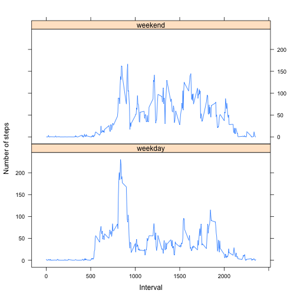

```r
options(scipen = 999, digits = 2)
```
## Loading the data
Unzip the file if necessary and read into variable

```r
zip.file <- "activity.zip"
csv.file <- "activity.csv"
if (!file.exists(csv.file)) unzip(file_name)
csv <- read.csv(file=csv.file)
str(csv)
```

```
## 'data.frame':	17568 obs. of  3 variables:
##  $ steps   : int  NA NA NA NA NA NA NA NA NA NA ...
##  $ date    : Factor w/ 61 levels "2012-10-01","2012-10-02",..: 1 1 1 1 1 1 1 1 1 1 ...
##  $ interval: int  0 5 10 15 20 25 30 35 40 45 ...
```

```r
head(csv, n=1)
```

```
##   steps       date interval
## 1    NA 2012-10-01        0
```

## What is mean total number of steps taken per day?
Below is a histogram showing the distribution of total daily steps

```r
# total steps by date and cast into data.frame
ds.t <- tapply(csv$steps, csv$date, sum)#, na.rm=TRUE)
ds <- data.frame(date=as.Date(rownames(ds.t)), steps=ds.t, row.names=NULL)
ds.na.rm <- ds[!is.na(ds$steps),]

# plot steps as ggplot2 histogram
library(ggplot2)
gh <- ggplot(data=ds, aes(x=ds$steps))
gh <- gh + geom_histogram(binwidth=2000)
# add labels
gh <- gh + xlab("Steps")
gh <- gh + ylab("Frequency")
gh <- gh + labs(title="Histogram of total steps taken per day")
print(gh)
```

 

```r
# Calculate and print average (mean, median) values
mean <- mean(ds$steps, na.rm=TRUE); print(mean)
```

```
## [1] 10766
```

```r
median <- median(ds$steps, na.rm=TRUE); print(median)
```

```
## [1] 10765
```
Mean number of steps taken per day is 10766  
Median number of steps taken per day is 10765

## What is the average daily activity pattern?
Group the steps by 5 minute interval and calculate the means. Plot this data as a line chart.

```r
# take mean of steps grouped by interval and then cast as data.frame
im.t <- tapply(csv$steps, csv$interval, mean, na.rm=TRUE)
im <- data.frame(
    interval=as.numeric(rownames(im.t)), int.avg=im.t, row.names=NULL)

# create base system line plot of average daily activity
plot(
    im$int.avg ~ im$interval, type="l",
    main="Average steps per 5-minute interval",
    xlab="5 minute interval", ylab="Average steps")
```

 

Calculate the interval and time that is the most active (on average):

```r
most.active.interval <- head(im[order(im$int.avg, decreasing=TRUE),],n=1)
print(most.active.interval)
```

```
##     interval int.avg
## 104      835     206
```
The 5 minute interval with most steps on average is 08:35-08:40, with 206 steps on average.

## Imputing missing values


```r
print(sum(is.na(csv$steps)))
```

```
## [1] 2304
```
There are 2304 missing values in the dataset. These will be substituted in a new variable `csv2` with the median value for the relevant interval across all dates in the dataset.


```r
# create copy of original data frame
csv2 <- csv
# Compute mean number of steps for each interval, using the original csv
imd.t <- tapply(csv$steps, csv$interval, mean, na.rm=TRUE)
imd <- data.frame(
    interval=as.numeric(rownames(imd.t)), mean.steps=imd.t, row.names=NULL)

# Impute missing value with interval median value and store in copied data.frame
for (i in 1:nrow(csv2)) {
    if (is.na(csv2[i,"steps"])) {
        csv2[i,"steps"] <- imd[imd$interval==csv2[i,"interval"],"mean.steps"]
    }
}

# total steps by date and cast into data.frame
ds2.t <- tapply(csv2$steps, csv$date, sum, na.rm=TRUE)
ds2 <- data.frame(date=as.Date(rownames(ds2.t)), steps=ds2.t, row.names=NULL)
```

As you would expect, there are now no values with NA in the imputed dataset:

```r
print(sum(is.na(csv2$steps)))
```

```
## [1] 0
```

In the daily summary dataset (`ds`), there were 8 days with zero or NA steps taken  ...

```r
print(nrow(ds[ds$steps==0 | is.na(ds$steps),]))
```

```
## [1] 8
```
...whereas after imputing the missing values (`ds2`), there are no days with zero steps taken:

```r
print(nrow(ds2[ds2$steps==0 | is.na(ds2$steps),]))
```

```
## [1] 0
```

The following code shows us that if a given date had *any* NAs in the original dataset, then it had *all* NAs for that day i.e. each day's data was either fully complete or fully missing


```r
all.dates <- unique(csv$date)
dates.with.all.nulls <- all.dates[which(sapply(all.dates, function(x) {
    all(is.na(csv[csv$date==x,"steps"]))}))]
dates.with.any.nulls <- all.dates[which(sapply(all.dates, function(x) {
    any(is.na(csv[csv$date==x,"steps"]))}))]

# Confirm that "dates with all nulls" is the same as "dates with any nulls"
print(identical(dates.with.all.nulls, dates.with.any.nulls))
```

```
## [1] TRUE
```


```r
#plot steps as histogram
gh2 <- ggplot(data=ds2, aes(x=ds2$steps)) + geom_histogram(binwidth=2000)
gh2 <- gh2 + xlab("Steps")
gh2 <- gh2 + ylab("Frequency")
gh2 <- gh2 + labs(title="Histogram of total steps taken per day")
print(gh2)
```

 

What is the impact of imputing missing data on the estimates of the total daily number of steps?

```r
sum2 <- sum(ds2$steps); print(sum2);
```

```
## [1] 656738
```

```r
print(sum2 - sum(ds$steps, na.rm=TRUE))
```

```
## [1] 86130
```
The total number of steps in the imputed dataset is 656738, which is 86130 more than in the original dataset.


```r
# Calculate and print average (mean, median) values, including difference from the original average values as well as % change
mean2 <- mean(ds2$steps); print(mean2); print(mean2-mean)
```

```
## [1] 10766
```

```
## [1] 0
```

```r
median2 <- median(ds2$steps); print(median2); print(median2 - median)
```

```
## [1] 10766
```

```
## [1] 1.2
```
Mean number of steps taken per day is 10766 when including imputed data, the same as the mean of the original dataset. This will be on account of the missing values being the means themselves.

Median number of steps taken per day is 10766 when including imputed data, which is only 1.2 more than the median of the non-imputed dataset.


## Are there differences in activity patterns between weekdays and weekends?
The below determines the day of the week for each data entry, before assigning it into two groups, weekend and weekday.

```r
# Convert date variable to date type, add day-of-week (dow) variable
csv2$date <- as.Date(csv2$date)
csv2$dow <- weekdays(csv2$date)

# create new factor variable 'day.type', setting value to weekend or weekday
csv2$day.type=as.factor(
    ifelse(csv2$dow %in% c("Saturday", "Sunday"), "weekend", "weekday"))

library(reshape2)
library(lattice)
# calculate mean steps for each pairing of interval/day.type
# and convert to data.frame
wkim <- tapply(
    csv2$steps, list(csv2$interval, csv2$day.type), mean, na.rm=TRUE)
wkim.df <- data.frame(
    interval=rownames(wkim), weekday=wkim[,1],
    weekend=wkim[,2],
    row.names=NULL)
head(wkim.df, n=1)
```

```
##   interval weekday weekend
## 1        0     2.3    0.21
```

```r
# melt weekend/weekday colums into single column
# and convert interval variable to numeric
wkim.m <- melt(wkim.df, measure.vars=c("weekday", "weekend"),
               value.name="mean.steps",
               variable.name="day.type")
wkim.m$interval.num = as.numeric(as.character(wkim.m$interval))
head(wkim.m, n=1)
```

```
##   interval day.type mean.steps interval.num
## 1        0  weekday        2.3            0
```

```r
# create lattice panel plot of mean steps per interval, grouped by
# weekend/weekday (day.type)
with(wkim.m,xyplot(
    mean.steps ~ interval.num | day.type, type="l",
    layout=c(1,2),
    xlab="Interval", ylab="Number of steps"))
```

 


This chart suggests that weekend activity is more evenly spread during the day with many spikes of rougly the same size; the weekdays show a pronounced spike in the morning (around 9am), with just 2-3 much smaller spikes during the course of the day. Perhaps this is on account of the subject having a desk-bound day-job.
